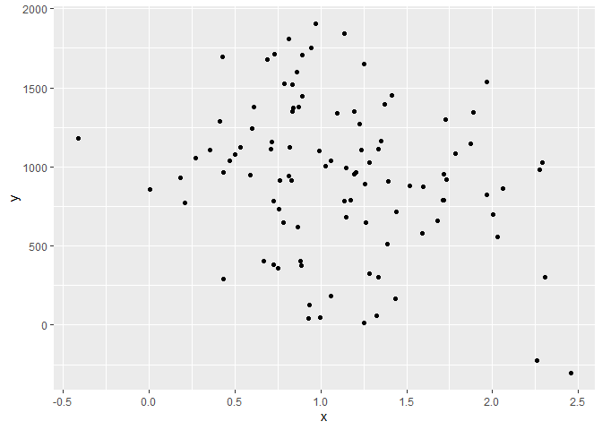
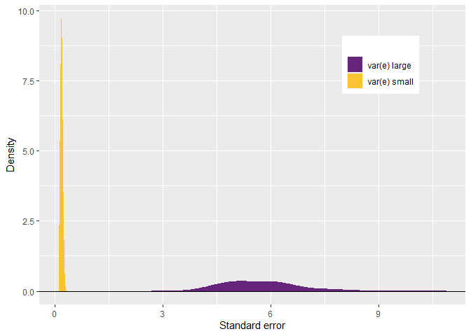
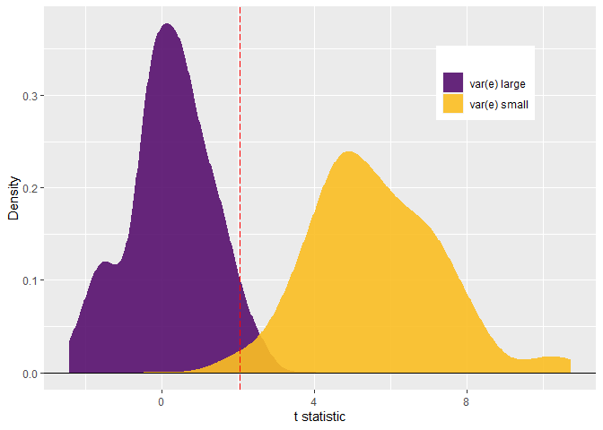
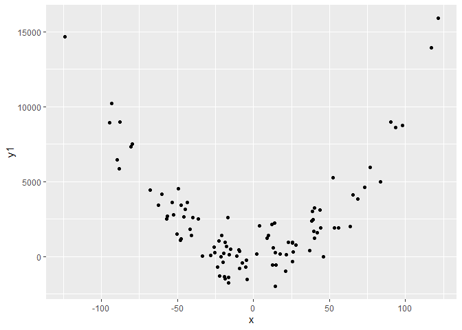

```r
library(pacman)
p_load(tidyverse, ggplot2, magrittr, purrr, estimatr, viridis, ggthemes)
# p_load(broom, leaflet, ggplot2, ggthemes, viridis, dplyr, magrittr, knitr, parallel, rddtools, readxl, emoGG, dslabs, gapminder, extrafont, Ecdat, wooldridge, tidyverse, janitor, kableExtra, gridExtra, estimatr)
```

## Guideline
> Due date: 12 January 2020
>
> Please have your simulation ready to share in class on Tuesday.

When people make the claim that _correlation does not imply causation_, they usually mean that the existence of some correlation between $y$ and $x_1$ does not imply that variation in $x_1$ _causes_ variation in $y$.

- That is, they tend to be acknowledging that you can have correlation without causation

**Assignment** Propose and simulate a data-generating process in which (**i**) causation runs from $x_1$ to $y$ but at the same time (**ii**) the correlation of $y$ and $x_1$ is zero. Write it in an Rmd file and make the argument visually.

- Yes, at the end of this you should have simulated something (good) and demonstrated that the lack of correlation does not imply lack of causation (which is like a party trick).


## Formal Definition of Correlation

$$
\begin{aligned}
  r_{xy} 
  &= \frac{s_{xy}}{s_{x}s_{y}} \\
  &= \frac{(n-1)^{-1}\sum_{i=1}^{n}(x_i-\bar{x})(y_i-\bar{y})}
  {(n-1)^{-1}\sqrt{\sum_{i=1}^n(x_i-\bar{x})^2\sum_{i=1}^{n}(y_i-\bar{y})^2}}\\
  &= \frac{\sum_{i=1}^{n}(x_i-\bar{x})(y_i-\bar{y})}
  {\sqrt{\sum_{i=1}^n(x_i-\bar{x})^2\sum_{i=1}^{n}(y_i-\bar{y})^2}}
\end{aligned}
$$
To make correlation equal to zero, it should either be that the numerator which is the covariance between $x$ and $y$ is sufficiently small to approach zero, or that the denominator is sufficiently large which could happen if either the variation of $x$ or $y$ is very large. In the example that follows, I considered a case where the variance of $y$ is large that is driven by some omitted variable $z$.  


```r
## Looking at correlation
fun_iter_corr <- function(iter, n = 30){
  iter_df <- tibble(
    e = rnorm(n, 0, 1),
    z = rnorm(n, -100, 10),
    x = rnorm(n, 1, 0.5), 
    y = x + z + e
  )
  corr<- cor(iter_df$x, iter_df$y)
}

sim_df<-sapply(1:1000, fun_iter_corr)
sim_df<-as.data.frame(sim_df)


ggplot() + 
  geom_density(data = sim_df, aes(x = sim_df), color = "black")+
  xlab("correlation")  +
  geom_vline(xintercept = 0, linetype = "longdash", color = "red") 
```

<!-- -->


## Correlation in Broader Sense

More broadly, suppose we define the correlation being the statistical significance of $x_1$ on $y$. In other words, if the null hypothesis that the coefficient estimate of $x_1$ on $y$ is zero is rejected at some alpha percent significance level, then $x_1$ is defined to be correlated with $y$. In other words, if we fail to reject the null hypothesis, then this implies that the coefficient estimate of $x_1$ on $y$ is not statistically different from zero, i.e. $x_1$ is not correlated with $y$. 

Suppose that $y$ is the sum of $x_1$ and $\varepsilon$, i.e. random disturbances. When the magnitude and the standard error of the random disturbance, $\varepsilon$, is relatively greater than the causal factor, $x_1$, the coefficient estimate of $x_1$ could be reported as not statistically significant. See the example below:


```r
# first iteration
data1 = tibble(e = rnorm(100, 1000, 500),
               x = rnorm(100, 1, 0.5), 
               y = x + e)
summary(lm(y~x, data = data1))
```

```
## 
## Call:
## lm(formula = y ~ x, data = data1)
## 
## Residuals:
##     Min      1Q  Median      3Q     Max 
## -961.23 -260.93   27.48  336.18  931.59 
## 
## Coefficients:
##             Estimate Std. Error t value Pr(>|t|)    
## (Intercept)  1175.68     106.32  11.058   <2e-16 ***
## x            -209.81      85.52  -2.453   0.0159 *  
## ---
## Signif. codes:  0 '***' 0.001 '**' 0.01 '*' 0.05 '.' 0.1 ' ' 1
## 
## Residual standard error: 466.7 on 98 degrees of freedom
## Multiple R-squared:  0.05787,	Adjusted R-squared:  0.04825 
## F-statistic: 6.019 on 1 and 98 DF,  p-value: 0.01592
```

```r
ggplot(aes(x = x, y = y), data = data1)+geom_point()
```

<!-- -->

```r
cor(data1$x, data1$y)
```

```
## [1] -0.2405553
```

```r
# function
fun_iter_l <- function(iter, n = 30) {
  iter_df <- tibble(
    e = rnorm(n, 0, 15), 
    x = rnorm(n, 1, 0.5), 
    y = x + e
  )
  lm <- lm_robust(y ~ x, data = iter_df, se_type = "classical")
  bind_rows(tidy(lm)) %>% 
    select(1:5) %>% filter(term == "x") %>% 
    mutate(se_type = c("classical"), i = iter, variation="large")
}

fun_iter_s <- function(iter, n = 30, a, b) {
  # Generate data
  iter_df <- tibble(
    e = rnorm(n, 0, 0.5), 
    x = rnorm(n, 1, 0.5), 
    y = x + e
  )
  # Estimate models
  lm <- lm_robust(y ~ x, data = iter_df, se_type = "classical")
  # Stack and return results
  bind_rows(tidy(lm)) %>%
    select(1:5) %>% filter(term == "x") %>%
    mutate(se_type = c("classical"), i = iter, variation="small")
}


# perform 100 iteration
p_load(purrr)
set.seed(1234)
sim_list_l <- map(1:100, fun_iter_l)
sim_list_s <- map(1:100, fun_iter_s)
sim_df <- bind_rows(sim_list_l, sim_list_s)
sim_df_s <- bind_rows(sim_list_s)

#plotting
ggplot(data = sim_df, aes(x = std.error, fill = variation)) +
  geom_density(color = NA) +
  geom_hline(yintercept = 0) +
  xlab("Standard error") +
  ylab("Density") +
  scale_fill_viridis(
    "", labels = c("var(e) large", "var(e) small"), discrete = T,
    option = "B", begin = 0.25, end = 0.85, alpha = 0.9
  ) +
   theme(legend.position = c(0.8, 0.8))
```

<!-- -->

```r
ggplot(data = sim_df, aes(x = statistic, fill = variation)) +
  geom_density(color = NA) +
  geom_hline(yintercept = 0) +
  geom_vline(xintercept = qt(0.975, df = 28), linetype = "longdash", color = "red") +
  xlab("t statistic") +
  ylab("Density") +
  scale_fill_viridis(
    "", labels = c("var(e) large", "var(e) small"), discrete = T,
    option = "B", begin = 0.25, end = 0.85, alpha = 0.9
  ) +
  theme(legend.position = c(0.8, 0.8))
```

<!-- -->

The first graph above shows the distribution of the standard error of $\hat{\beta}$ from 100 iterations (i.e. simulation). The distribution of the standard error of $\hat{\beta}$ when the variation of the disturbance is large tend to locate on the farther right to the distribution of the standard error of $\hat{\beta}$ when the variation of the disturbance is small. This implies that the volatility of the disturbance could result in large variation in the standard error of the point estimate of $\beta$. If such is the case, it is likely that the t-stat calculated based on it is reported to be small, which results in higher likelihood of not rejecting the null hypothesis that $\beta$ is zero, i.e. no correlation between $y$ and $x_1$. 

The next graph shows the distribution of t-statistic of $\hat{\beta}$ from 100 iterations. The red dotted line denotes the 95$\%$ confidence interval. When the t-statistic for each 100 point estimate of $\beta$ falls outside the red dotted line, this indicates that we are likely to reject the null hypothesis that $\beta$ is zero. Notice that when the variance of disturbance term is small, we are more likely to conclude that $\beta$ estimate being different from 0. In other words, we are more likely to conclude causal inference from the regression. However, when the variation of the disturbance is large, the t-statistic of 100 point estimate of $\beta$ is likely to locate within the confidence interval, which may lead us to conclude that there is insufficient evidence to conclude causal relationship between $y$ and $x_1$. 


## Other cases

- When the model is misspecified: when the model is linearly specified in x when the true functional form of x is quadratic.

```r
df2 = tibble(x = rnorm(100, 2, 50), 
             z = rnorm(100, 3, 1000),
             e = rnorm(100, 0, 1),
             y1 = x^2 + z + e,
             y2 = x^2 + e,
             y3 = x + e)
ggplot(data = df2, aes(x = x, y = y1)) + geom_point()
```

<!-- -->

```r
summary(lm(y1~x, data = df2))
```

```
## 
## Call:
## lm(formula = y1 ~ x, data = df2)
## 
## Residuals:
##     Min      1Q  Median      3Q     Max 
## -4421.6 -2256.9  -926.2  1130.8 13149.6 
## 
## Coefficients:
##             Estimate Std. Error t value Pr(>|t|)    
## (Intercept) 2428.594    347.568   6.987 3.41e-10 ***
## x              2.522      6.986   0.361    0.719    
## ---
## Signif. codes:  0 '***' 0.001 '**' 0.01 '*' 0.05 '.' 0.1 ' ' 1
## 
## Residual standard error: 3471 on 98 degrees of freedom
## Multiple R-squared:  0.001328,	Adjusted R-squared:  -0.008863 
## F-statistic: 0.1303 on 1 and 98 DF,  p-value: 0.7189
```

```r
# ggplot(data = df2, aes(x = x, y = y2)) + geom_point()
# summary(lm(y2~x, data = df2))
```
- When the sample that we are using from the data is truncated in a way that does not show a correlation

