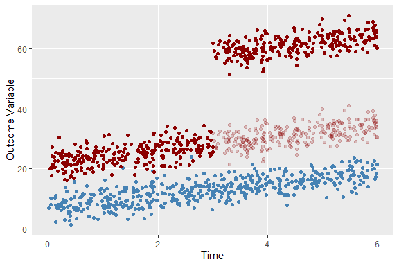
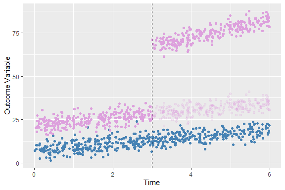
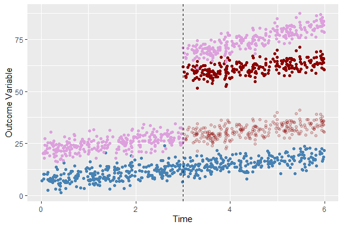
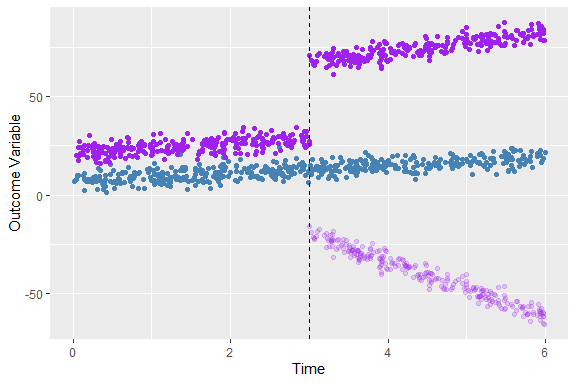
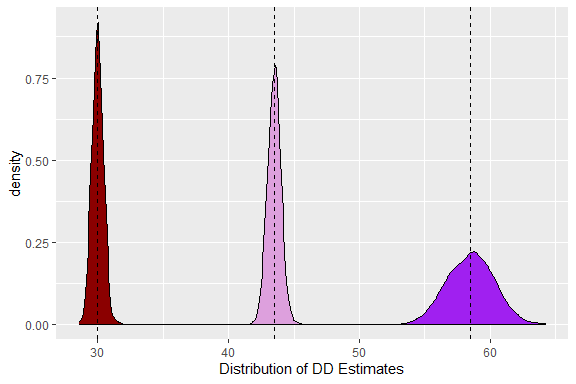
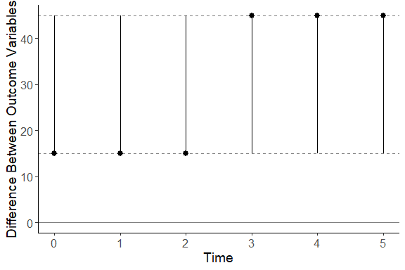
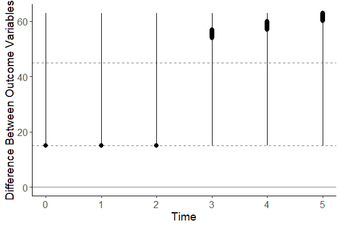

## A5 - DD trends

---

> Due date: 16 February 2021

---

**Part 1.** Demonstrate that "_parallel trends in the absence of treatment_" is not sufficient to justify the difference-in-differences estimator&mdash;that, in order to identify a treatment-induced change in some outcome with a DD strategy, we must assume that outcomes in treated and control units are parallel _throughout the period of analysis_. Since we can evidence common pre-treatment trends, it is, if anything, in the _presence_ of treatment where the assumption is most active, in a way. 


*Q:* What is the DD model prepared to well identify? (_Level differences._) 


```r
n = 1000
t = 6

sim_fun = function(n = 1000, t = 6, beta0 = 15, beta1 = 2, beta2 = 3, alpha = 7, TEffect=30){
df = tibble(
  time1 = runif(n, min=0, max = t),
  time = as.integer(time1),
  ind_id = seq(1:n),
  error = rnorm(n, 0, 3),
  post = as.numeric(time1 >= t/2),
  
  # assignment of treatment
  treat = sample(c(0,1), n, prob=c(0.5, 0.5), replace = TRUE),
  
  # outcome variables
  ## pre-treatment period (parellel trends assumed)
  y_pre = alpha + beta1* time1 + beta0*treat + error,
  ## pre-treatment period (parellel trends violated)
  y_pre2 = alpha + beta1* time1*(1-post) - 7*beta1*time1*post + beta0*treat + error,
  
  ## post-treatment period (assumed parallel trend by using the same beta1)
  y_post = alpha + beta1* time1 + beta0*treat + TEffect*treat + error,

  ## separating controls 
  y_pre_c = alpha + beta1* time1  + error,
  y_post_c = alpha + beta1* time1  + error,
  y_c = ifelse(post ==0, y_pre_c, y_post_c),

  ## separating treated
  y_pre_t = alpha +  beta1*time1 + beta0 + error,
  ## consider level changes in post-treatment periods
  y_post_t1 = alpha + TEffect + beta1*time1  + beta0 + error, 
  ## consider level as well as slope changes in post-treatment periods
  y_post_t2 = alpha + TEffect + (beta1+beta2)*time1 + beta0 +  error,
  ## create treated outcomes throughout the analysis periods(level diff)
  y_t1 = ifelse(post ==0, y_pre_t, y_post_t1),
  ## create treated outcomes throughout the analysis periods(level&slope diff)
  y_t2 = ifelse(post ==0, y_pre_t, y_post_t2),
  
  # y
  y1 = ifelse(treat==0, y_c, y_t1),
  y2 = ifelse(treat==0, y_c, y_t2),
  y3 = ifelse(post==0, y_pre, y_post),
  y4 = ifelse(post==0, y_pre2, y_post),
  
  ## taking the difference
  diff1 = y_t1-y_c,
  diff2 = y_t2-y_c
)
return(df)
}

one_iter = sim_fun()
```

I considered three cases:

- In the first case, I assume parallel trends throughout the analysis period. Here, I only assume the level of treated outcomes shifts in post-treatment periods.

$$
y_{it} = \alpha+\beta_0T_i+\beta_1S_t+TEffect(T_i \times S_t) +\varepsilon_{it}
$$

```r
ggplot() + 
  geom_point(data = one_iter %>% filter(treat==0), aes(x = time1, y = y_c), color = "steelblue") +
  geom_point(data = one_iter %>% filter(treat==1), aes(x=time1, y=y_t1), color = "darkred") +
  geom_point(data = one_iter %>% filter(treat==1), aes(x=time1, y=y_pre), color = "darkred", alpha = 0.2) +
  geom_vline(xintercept=t/2, linetype = "dashed")+
  xlab("Time")+
  ylab("Outcome Variable")
```



- In the second case, parallel trends throughout the analysis period is assumed but both the level and the slope of the treated outcomes shift in post-treatment periods.

$$
y_{it} = \alpha+\beta_0T_i+(\beta_1+\beta_2)S_t+TEffect(T_i \times S_t) +\varepsilon_{it}
$$


```r
ggplot() + 
  geom_point(data = one_iter %>% filter(treat==0), aes(x = time1, y = y_c), color = "steelblue") +
  geom_point(data = one_iter %>% filter(treat==1), aes(x=time1, y=y_t2), color = "plum") +
  geom_point(data = one_iter %>% filter(treat==1), aes(x=time1, y=y_pre), color = "plum", alpha = 0.2) +
  geom_vline(xintercept=t/2, linetype = "dashed")+
  xlab("Time")+
  ylab("Outcome Variable")
```



- The slope change in post-treatment period is more visible from the following plot that combines plots in case 1 and case 2. 


```r
ggplot() + 
  geom_point(data = one_iter %>% filter(treat==0), aes(x = time1, y = y_c), color = "steelblue") +
  geom_point(data = one_iter %>% filter(treat==1), aes(x=time1, y=y_t1), color = "darkred") +
  geom_point(data = one_iter %>% filter(treat==1), aes(x=time1, y=y_pre), color = "darkred", alpha = 0.2) +
  geom_point(data = one_iter %>% filter(treat==1), aes(x=time1, y=y_t2), color = "plum") +
  geom_vline(xintercept=t/2, linetype = "dashed")+
  xlab("Time")+
  ylab("Outcome Variable")
```



- In the last case, parallel trend assumption is violated and the gap between treated outcomes and the outcomes in control increases over time in post-treatment periods.


```r
ggplot() + 
  geom_point(data = one_iter %>% filter(treat==0), aes(x = time1, y = y_c), color = "steelblue") +
  geom_point(data = one_iter %>% filter(treat==1), aes(x=time1, y=y_t2), color = "purple") +
  geom_point(data = one_iter %>% filter(treat==1), aes(x=time1, y=y_pre2), color = "purple", alpha = 0.2) +
  geom_vline(xintercept=t/2, linetype = "dashed")+
  xlab("Time")+
  ylab("Outcome Variable")
```



The sample size is set to be 1000 with six periods. I have set the value of treatment effect equal to 30. I performed 1000 iterations to estimate the treatment effect using DD model. The plot colored in dark red denotes the distribution of the estimate in case 1. The plot colored in plum denotes the distribution of the estimate in case 2. The plot colored in purple denotes the distribution of the estimate in case 3. Notice that DD estimator produces consistent estimate of the treatment effect only in case 1 when parallel trends is assumed not just in pre-treatment periods but throughout the analysis periods. Recall that the true parameter of the treatment effect from DD model is 30. Notice also that when parallel trends assumption is violated such that the counterfactual of the treated in post-treatment periods is no longer a constant increase of the control, the DD estimate is inconsistent and in this specific case is upward biased.   


```r
model_sim= function(n = 1000, t = 6, beta0 = 15, beta1 = 2, beta2 = 3, alpha = 7, TEffect=30){
  d = sim_fun(n, t , beta0 , beta1 , beta2 , alpha , TEffect)
  m1 = lm(y1~treat*post, data = d) %>% summary()
  m2 = lm(y2~treat*post, data = d) %>% summary()
  b1 = m1$coefficients[4,1]
  b2 = m2$coefficients[4,1]
  se1 = m1$coefficients[4,2]
  se2 = m2$coefficients[4,2]
  b3 = (mean(d$y_post[one_iter$treat == 1]) - mean(d$y_pre2[one_iter$treat == 1])) -
  (mean(d$y_post[d$treat == 0]) - mean(d$y_pre[one_iter$treat == 0]))
  return(c(beta_p = b1,
           se_p = se1,
           beta_np= b2,
           se_np = se2,
           beta_np2=b3))
}

n_sims=1000
sim_data = replicate(n_sims, model_sim(n = 1000, 
                                       # number of periods
                                       t = 6, 
                                       # diff in pre- post- control
                                       beta0 = 15, 
                                       # parallel trend between treated and control
                                       beta1 = 2,
                                       # non-parallel trend between treated and control
                                       # increased trend by beta2 in post-treatment periods
                                       beta2 = 3,
                                       # intercept
                                       alpha = 7, 
                                       # DD treatment effect
                                       TEffect=30))

sim_data = as_tibble(t(sim_data))
sim_data$id = seq(1:nrow(sim_data))
ggplot()+
  geom_density(aes(beta_p),sim_data, fill = "darkred")+
  geom_vline(xintercept=mean(sim_data$beta_p), linetype = "dashed") +
  geom_density(aes(beta_np), sim_data, fill = "plum")+
  geom_vline(xintercept=mean(sim_data$beta_np), linetype = "dashed") +
  geom_density(aes(beta_np2), sim_data, fill = "purple")+
  geom_vline(xintercept=mean(sim_data$beta_np2), linetype = "dashed") +
  xlab("Distribution of DD Estimates")
```




*Q:* Where do changes in slope (say, subsequent to treatment) show up then? (_They end up in the DD estimate. Do we want it to? Is there theory suggesting that we should anticipate only a level shift, or a change in both level and slope?_)

The changes in slope shows up as part of the DD estimate. Notice that the DD estimate is inflated in case 2 compared to case 1. Recall that in case 2, I consider the changes in slope as well as the changes in the level in post-treatment periods. Thus if we see a positive change in slope in post-treatment periods, the DD estimate is upward biased. 


<br>

---

**Part 2.** Produce an event study figure on the same DGP.
<br>

```r
ggplot(one_iter, aes(x = time, y = diff1)) +
  geom_pointrange(aes(ymin = min(diff1), ymax = max(diff1)), alpha = 0.7) +
  geom_vline(xintercept = n/2, alpha = 0.3, linetype = "dashed", size = 0.3) +
  theme_classic() +
  geom_hline(yintercept = 0, alpha = 0.5, size = 0.5) +
  geom_hline(yintercept = 15, alpha = 0.5, linetype="dashed", size = 0.5, show.legend=TRUE) +
  geom_hline(yintercept = 45, alpha = 0.5, linetype="dashed", size = 0.5, show.legend=TRUE) +
  ylab("Difference Between Outcome Variables") +
  xlab("Time") +
  theme(
    axis.text = element_text(size = 12),
    axis.title = element_text(size = 14)
  )+
  xlim(0,5)
```



I plotted the difference in outcomes between treated and control across time that corresponds to case 1, i.e. when there is only level difference. This plot shows a one-time increase in the difference in outcomes between treated and control group at period 3, when the treatment is first introduced. Notice that the difference in outcomes stays constant across post-treatment periods. 


```r
ggplot(one_iter, aes(x = time, y = diff2)) +
  geom_pointrange(aes(ymin = min(diff2), ymax = max(diff2)), alpha = 0.7) +
  geom_vline(xintercept = n/2, alpha = 0.3, linetype = "dashed", size = 0.3) +
  # geom_line(data = df, aes(x = time1, y = dind_coef, group = (time1 >= 0)), color = "red", alpha = 0.7) +
  # geom_line(data = df, aes(x = label, y = dind_coef + 1.96 * dind_se, group = (label >= 0)), linetype = "dashed", color = "red", alpha = 0.7) +
  # geom_line(data = df, aes(x = label, y = dind_coef - 1.96 * dind_se, group = (label >= 0)), linetype = "dashed", color = "red", alpha = 0.7) +
  theme_classic() +
  geom_hline(yintercept = 0, alpha = 0.5, size = 0.5) +
  geom_hline(yintercept = 15, alpha = 0.5, linetype="dashed", size = 0.5, show.legend=TRUE) +
  geom_hline(yintercept = 45, alpha = 0.5, linetype="dashed", size = 0.5, show.legend=TRUE) +
  ylab("Difference Between Outcome Variables") +
  xlab("Time") +
  theme(
    axis.text = element_text(size = 12),
    axis.title = element_text(size = 14)
  )+
  xlim(0,5)
```



I plotted the difference in outcomes between treated and control across time that corresponds to case 2, i.e. when there are both slope and level difference. This plot also shows a significant increase in the difference in outcomes between treated and control group starting period 3, when the treatment is first introduced. However notice that the difference in outcomes no longer stays constant across post-treatment periods. The effect of slope changes is now reflected through the increasing difference in outcomes between treatment group and control group over time in post-treatment periods. Therefore, depending on the length of the post-treatment periods, the treatment effect estimate varies using DD model. If the theory suggests that the intensity of the treatment increases over time, then it would be reasonable to consider a change to both level and slope. However, researchers may need to provide a convincing argument about quantifying the treatment intensity that changes over time as well as selecting the length of the post-treatment periods.

---

