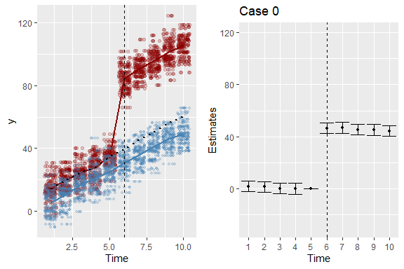
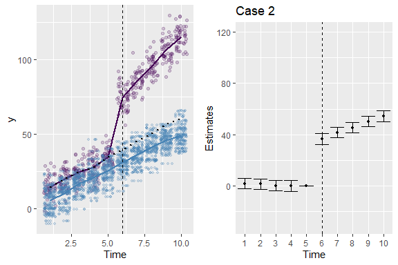
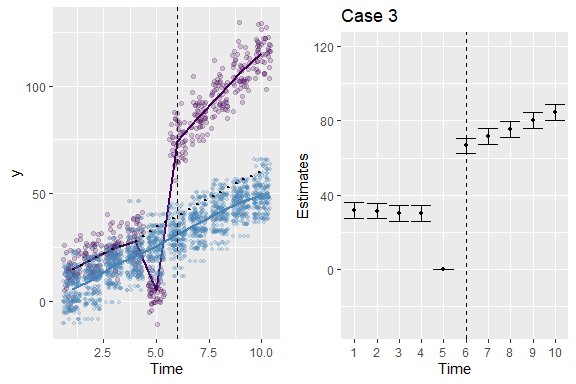

# {.tabset .tabset-fade .tabset-pills}


## A6 - Event study

---

> Due date: 25 February 2021?

---

An event study can be described by the estimation of the model,
$$y_{it} = \alpha_i + \sum_{t~\ne~T-1}\beta_t~(T_{it}=1)+e_{it}~,$$
where $T_{it}=1$ captures the arrival of treatment (in period $T$). The sum is meant to imply that the omitted category is the period prior to the onset of treatment.

**Part 1.** Simulate a DGP in which treatment is imposed on a fraction of units in a panel. Adopting something like the DGP of A5 would be reasonable. Produce an event study figure that represents the effect of treatment on outcomes.

Below is the event study figure where the treated and control follow a parallel trend in the pre-treatment period but diverging trend in the post-treatment period. 


```r
##########################
# formulating dgp function
dgp_fun = function(ind_totalID = 6, 
                   pre_totalT = 5, 
                   post_totalT = 5, 
                   alpha = 10,
                   beta = 40){
  # setting the number of periods
  time = rep(1:(pre_totalT+post_totalT), each = ind_totalID)
  # setting the number of ids
  ind_ID = rep(1:ind_totalID, pre_totalT + post_totalT)
  # setting the number of observations
  n = 1:length(ind_ID)*length(time)
  # setting the error term 
  error = rnorm(n, 0, 1)
  # setting the treatment
  treat = sample(c(0,1), size = ind_totalID, replace=TRUE, prob=c(0.5, 0.5))

  # generating individual level variation (alpha)
  ## same level of variation between treated and control group
  alpha_noise = rnorm(ind_totalID, 0,1)
  ## no variation of slope across pre-treatment periods (parallel trend pre period)
  beta_noise_pre = rep(0, each=pre_totalT*ind_totalID)
  ## variation of slope across post-treatment period (non-parallel trend post period)
  beta_noise_post = rep(sapply(1:post_totalT, function(x){rnorm(1, 2*x, 1)}), each = ind_totalID)
  
  beta_noise = c(beta_noise_pre, beta_noise_post)
  DT = data.table(treat, n, pre_totalT, time, ind_ID, alpha, 
                  alpha_noise, beta, beta_noise, error)
  DT[, ':=' (alpha_ind = alpha + alpha_noise,
             beta_ind = beta + beta_noise), by = ind_ID][
        , y := alpha_ind + beta_ind*treat + error][
          , ':=' (upper = max(y), lower = min(y)), by=time]
  return(DT)
}
d = dgp_fun()

##########################################################
# plot
d$time = relevel(factor(d$time), ref="5")
est = feols(y ~ as.factor(time)*treat, data = d) 
est_sum = est %>% tidy() %>% filter(str_detect(term, coll(":treat")))
est_sum$time = as.numeric(str_sub(est_sum$term, 16, -7))
est_sum %<>% add_row(term = "as.factor(time)5:treat", 
                     estimate = 0,
                     std.error = 0,
                     statistic = 0,
                     p.value=0,
                     time = 5)
t_cv = qt(0.025, df = (max(d$n)-2), lower.tail = FALSE)
est_sum$ci_l = est_sum$estimate - t_cv*est_sum$std.error 
est_sum$ci_h = est_sum$estimate + t_cv*est_sum$std.error 
ggplot(est_sum, aes(x=factor(time), y = estimate)) + 
  geom_linerange(aes(ymin=ci_l, ymax=ci_h))+
  geom_pointrange(aes(ymin=ci_l, ymax=ci_h))+
  geom_errorbar(aes(ymin=ci_l, ymax=ci_h)) +
  xlab("Time") + ylab("Estimates") + 
  ggtitle("Event Study with Treatment Effect Increasing over Time")+
  geom_vline(xintercept=6, linetype="dashed")
```


<br>


**Part 2:** Build into that DGP the potential for **(i)** non-parallel trends, **(ii)** parallel pre-treatment trends, with trends diverging in post treatment periods, **(iii)** an Ashenfelter dip, and **(iv)** a treatment that is anticipated (in a way that has units "responding" before it arrives. (_There are more violations, obviously, but these are a good set to start with. Add others if you are in an area that you think has a particular challenge._)


```r
##########################################################
# generating dgp functions
dgp_fun2 = function(ind_totalID = 100, 
                    pre_totalT = 5, 
                    post_totalT = 5,
                    c_intercept = 0,
                    c_slope = 2,
                    t_slope = 4){
  # setting the number of periods
  time = rep(1:(pre_totalT+post_totalT), each = ind_totalID)
  post = (time > pre_totalT)
  # setting the number of ids
  ind_ID = rep(1:ind_totalID, pre_totalT + post_totalT)
  # setting the number of observations
  n = 1:length(time)
  # setting the error term 
  error = rnorm(n, 0, 5)
  # setting the treatment
  treat = sample(c(0,1), size = ind_totalID, replace=TRUE, prob=c(0.5, 0.5))
  # individual level
  alpha_noise_c = rnorm(ind_totalID, 0, 5)
  alpha_noise_t = rnorm(ind_totalID, 4, 5)
  alpha = ifelse(treat==0, alpha_noise_c, alpha_noise_t)
  # control outcome
  y_c = c_intercept + alpha_noise_c + c_slope * time +error
  # treated outcome
  ## parallel trend
  y_cf= c_intercept + 5 + alpha_noise_t + c_slope * time + error
  ## non-parallel trend
  y_t1 = c_intercept + 5 + alpha_noise_t + error
  ## diverging trend
  y_t2 = c_intercept + alpha_noise_t + ifelse(time<=5, 5+c_slope*time, 10+t_slope*time ) + error
  ## Aschenfelter dip
  y_t3 = c_intercept + alpha_noise_t + ifelse(time<=5, ifelse(time == 5, 0, 5+c_slope*time), 10+t_slope*time )+error
  ## Anticipated treatment
  y_t4 = c_intercept + alpha_noise_t + ifelse(time<=5, -c_slope*time, 10+t_slope*time )+error
  ## y 
  y = c_intercept + alpha_noise_c*(1-treat) + c_slope * time *(1-treat) + 
      alpha_noise_t*treat + 
      treat*(1-post)*(5+c_slope*time)+treat*post*(50+c_slope*time)+error
  y1 = treat*y_t1 + (1-treat)*y_c
  y2 = treat*y_t2 + (1-treat)*y_c
  y3 = treat*y_t3 + (1-treat)*y_c
  y4 = treat*y_t4 + (1-treat)*y_c
  
  DT = data.table(time, post, ind_ID, n, error, treat, alpha, alpha_noise_c, alpha_noise_t,
                  y_c, 
                  y,
                  y1,
                  y2,
                  y3,
                  y4,
                  y_cf, 
                  y_t1,
                  y_t2,
                  y_t3,
                  y_t4,
                  c_intercept,
                  c_slope,
                  t_slope,
                  pre_totalT,
                  post_totalT
                  )
  
  return(DT)
}
a =dgp_fun2(ind_totalID = 100, 
            pre_totalT = 5, 
            post_totalT = 5,
            c_intercept = 0,
            c_slope = 5,
            t_slope = 10)
b = a %>% pivot_longer(y_t1:y_t4, names_to = "case", values_to = "y_t")

##########################################################
# plotting
ggplot_fun = function(i){ggplot() + 
  geom_jitter(data = b[b$treat==1 & b$case==paste0("y_t", i),], 
              aes(x = time, y = y_t, color = case), alpha=0.2)  +
  stat_summary(data = b[b$treat==1 & b$case==paste0("y_t", i),],
              aes(x= time, y = y_t, color = case),fun=mean, geom="line", alpha = 1,size = 1) + 
  geom_jitter(data = b[b$treat==0,], 
              aes(x = time, y = y_c), color = "steelblue", alpha = 0.2, size = 1)+
  stat_summary(data = b[b$treat==0,], aes(x=time, y = y_c),color = "steelblue",
               fun=mean, geom="line", alpha = 1,size = 1)+
  stat_summary(data = b[b$treat==1 ,], 
               aes(x= time, y = y_cf), color = "black", fun=mean, geom="line", linetype = "dotted", alpha = 1,size = 1) +
  geom_vline(xintercept = 6, linetype="dashed")+
  ylab("y")+
  xlab("Time") +
  scale_color_viridis_d() +
  theme(legend.position="none")
}

##########################################################
# estimating
rep =  rep(0:4, each = 9)
model_sim= function(ind_totalID = 100, 
                    pre_totalT = 5, 
                    post_totalT = 5,
                    c_intercept = 0,
                    c_slope = 5,
                    t_slope = 10){
  a = dgp_fun2(ind_totalID , 
              pre_totalT , 
              post_totalT ,
              c_intercept ,
              c_slope,
              t_slope )
  a$time = relevel(factor(a$time), ref="5")
  est0 = feols(y~as.factor(time)*treat, data = a) %>% 
    tidy() %>% filter(str_detect(term, coll(":treat")))
  est1 = feols(y1~as.factor(time)*treat, data = a) %>% 
    tidy() %>% filter(str_detect(term, coll(":treat")))
  est2 = feols(y2~as.factor(time)*treat, data = a) %>% 
    tidy() %>% filter(str_detect(term, coll(":treat")))
  est3 = feols(y3~as.factor(time)*treat, data = a) %>%
    tidy() %>% filter(str_detect(term, coll(":treat")))
  est4 = feols(y4~as.factor(time)*treat, data = a) %>% 
    tidy() %>% filter(str_detect(term, coll(":treat")))
  ests = cbind(rbind(est0, est1, est2, est3, est4), rep)
  return(ests)
}

sim_data = model_sim()
sim_data %<>% 
  add_row(term = rep("as.factor(time)5:treat", 5), 
          estimate = rep(0,5), 
          std.error = rep(0,5), 
          statistic=rep(0,5), 
          p.value=rep(0, 5),
          rep = 0:4)
sim_data$time = as.numeric(str_sub(sim_data$term, 16, -7))
t_cv = qt(0.025, df = (max(a$n)-2), lower.tail = FALSE)
sim_data$ci_l = sim_data$estimate - t_cv*sim_data$std.error 
sim_data$ci_h = sim_data$estimate + t_cv*sim_data$std.error 

##########################################################
# plotting
plot_fun=function(i) {p = ggplot(sim_data %>% filter(rep==i), aes(x=factor(time), y = estimate)) + 
  geom_linerange(aes(ymin=ci_l, ymax=ci_h))+
  geom_pointrange(aes(ymin=ci_l, ymax=ci_h), size=0.2)+
  geom_errorbar(aes(ymin=ci_l, ymax=ci_h)) +
  xlab("Time") + ylab("Estimates") + ggtitle(paste("Case",i)) +
  ylim(-30, 120)+
  geom_vline(xintercept = 6, linetype="dashed")
  
   return(p)
}
```

Following graphs show the outcome of the treated as well as the outcome of the control group during the analysis period. There are five pre-treatment periods and five post-treatment periods. The treatment is first introduced at period 6. The number of subjects is set to 100. In the parallel trend assumption, we have the following plot and the event study figure.


```r
p0=ggplot() + 
  geom_jitter(data = b[b$treat==1,], 
              aes(x = time, y = y), color = "darkred", alpha=0.2)  +
  stat_summary(data = b[b$treat==1,],
              aes(x= time, y = y), color = "darkred", fun=mean, geom="line", alpha = 1,size = 1) + 
  geom_jitter(data = b[b$treat==0,], 
              aes(x = time, y = y_c), color = "steelblue", alpha = 0.2, size = 1)+
  stat_summary(data = b[b$treat==0,], aes(x=time, y = y_c),color = "steelblue",
               fun=mean, geom="line", alpha = 1,size = 1)+
  stat_summary(data = b[b$treat==1,], 
               aes(x= time, y = y_cf), color = "black", fun=mean, geom="line", linetype = "dotted", alpha = 1,size = 1) +
  geom_vline(xintercept = 6, linetype="dashed")+
  ylab("y")+
  xlab("Time") +
  scale_color_viridis_d() +
  theme(legend.position="none")
ef0=ggplot(sim_data %>% filter(rep==0), aes(x=factor(time), y = estimate)) + 
  geom_linerange(aes(ymin=ci_l, ymax=ci_h))+
  geom_pointrange(aes(ymin=ci_l, ymax=ci_h), size=0.2)+
  geom_errorbar(aes(ymin=ci_l, ymax=ci_h)) +
  xlab("Time") + ylab("Estimates") + ggtitle(paste("Case",0)) +
  ylim(-30, 120)+
  geom_vline(xintercept = 6, linetype="dashed")
grid.arrange(p0, ef0, ncol=2)
```




Now I investigate the cases that violate parallel trend assumption. Notice that the outcome trend of the control group is fixed and I only varied the outcome of the treated either in the post-treatment periods or in pre-treatment periods. I considered four cases that violate a parallel trend assumption. In the first case, I've set the treatment effect equal to zero and that the outcome of the treated is constant across the analysis period. In the second case, I've set the outcome of the treated to have a parallel trend with the outcome of the control in pre-treatment periods, but have it diverge in post treatment periods. In the third case, I've considered an Ashenfelter dip where the outcome of the treated falls significantly at one point in time, right before the introduction of the treatment. In the last case, I've set the outcome of the treated to slowly decrease until the point at which the treatment is introduced to account for an anticipated response to treatment among treated individuals. 


```r
grid.arrange(ggplot_fun(1), ggplot_fun(2), 
             ggplot_fun(3), ggplot_fun(4), ncol=2)
```


```r
grid.arrange(plot_fun(1),  plot_fun(2), 
             plot_fun(3), plot_fun(4), ncol=2)
```


```r
grid.arrange(ggplot_fun(1), plot_fun(1), ncol=2)
```


```r
grid.arrange(ggplot_fun(2), plot_fun(2), ncol=2)
```



```r
grid.arrange(ggplot_fun(3), plot_fun(3), ncol=2)
```



```r
grid.arrange(ggplot_fun(4), plot_fun(4), ncol=2)
```


---

